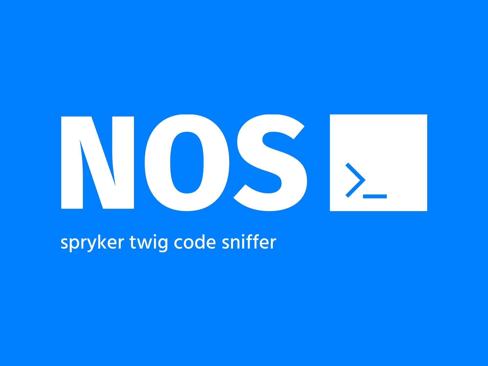

[](https://github.com/project-nos/spryker-twig-cs/blob/master/LICENSE)
[](https://github.com/project-nos/spryker-twig-cs/actions/workflows/tests.yml)
[](https://packagist.org/packages/project-nos/spryker-twig-code-sniffer)

_This package aims to be for twig templates in spryker what [phpcs](https://github.com/squizlabs/PHP_CodeSniffer) is to php. It checks your codebase for violations on coding standards._

## Installation

```
composer require --dev project-nos/spryker-twig-code-sniffer
```

## Setup

To use the provided console commands you will need to register the namespace `Nos` in `config/Shared/config_default.php`.

```php

$config[KernelConstants::CORE_NAMESPACES] = [
    // add 'Nos' as a core namespace
    'Nos',
];
```

In `src/Pyz/Zed/Console/ConsoleDependencyProvider.php` you need to register the console command plugin for deploy tasks.

```php
use Nos\Zed\TwigCodeSniffer\Communication\Console\TwigCodeSnifferConsole;

    protected function getConsoleCommands(Container $container): array
    {
        $commands = [
            // other registered console plugins ...
            new TwigCodeSnifferConsole(),
        ];
```
Then you should see a new command in the `code` section:

```text
code
   ...
   code:sniff:twig  Sniff and fix twig code style
   ...
```

### Definition
```text
Description:
  Sniff and fix twig code style

Usage:
  code:sniff:twig [options] [--] [<paths>...]

Arguments:
  paths                 Paths of files and folders to parse

Options:
      --level=LEVEL     Allowed values are notice, warning or error [default: "NOTICE"]
      --report=REPORT   Report format [default: "text"]
      --fix             Automatically fix all the fixable violations
      --no-cache        Disable cache while running the fixer
```

### Coding Standard

This package attempts to mimic the [official coding standard](https://twig.symfony.com/doc/3.x/coding_standards.html).


## License

Copyright (c) [Andreas Penz](https://github.com/andreaspenz). Licensed under the [MIT License](https://github.com/project-nos/spryker-twig-cs/blob/master/LICENSE).

